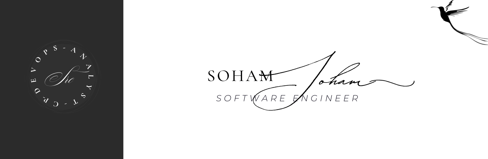

<!-- Banner -->

  

# Hi there 👋, I'm Soham Raj Chopra  

🚀 A passionate **developer & problem solver** who loves building impactful projects and learning new technologies.  

---

## 👨‍💻 About Me
- 🌱 Currently exploring **Data Analysis, Django, REST APIs, Clouds, and full-stack development**  
- 💡 Interested in **system design, DevOps, and cloud technologies**  
- 🛠️ I enjoy working with **Python, JavaScript, C++, and databases**  
- 📚 Always open to collaborating on **exciting projects**  
- ⚡ Fun fact: Debugging teaches patience better than meditation  

---

## 💼 Work Experience  

### 📍 **Data Analyst Intern**  
**GAIL (India) Limited (Remote)** | *August 2025 – Present*  
- Analyzing datasets & preparing reports for data-driven decision-making  
- Automating workflows using **Python, Pandas & SQL**  
- Developing dashboards & visualizations for insights  

### 📍 **Software Intern**  
**Radixlink India Pvt. Ltd. (Remote)** | *Jan 2025 – July 2025*  
- Built and tested backend features using **Django & REST APIs**  
- Worked on database design and query optimization  
- Contributed to frontend integration with React  

---

## 🛠️ Tech Stack  

**Languages:**  
`Python` | `C++` | `JavaScript` | `SQL`  

**Frameworks & Tools:**  
`Django` | `DRF` | `React` | `Node.js` | `Express` | `Tailwind`  

**Data Analysis & Visualization:**  
`Pandas` | `NumPy` | `Matplotlib` | `Seaborn` | `Jupyter Notebook` | `Excel`  

**Databases:**  
`PostgreSQL` | `MySQL` | `MongoDB` | `Redis`  

**Others:**  
`Git` | `Docker` | `Linux` | `AWS`  

---

## 📊 GitHub Stats  

        

---

## 🔥 GitHub Streak  

  

---

## 🌐 Connect With Me  

  
  

---

⭐️ From [Soham 🤠](https://github.com/Soham-047)
